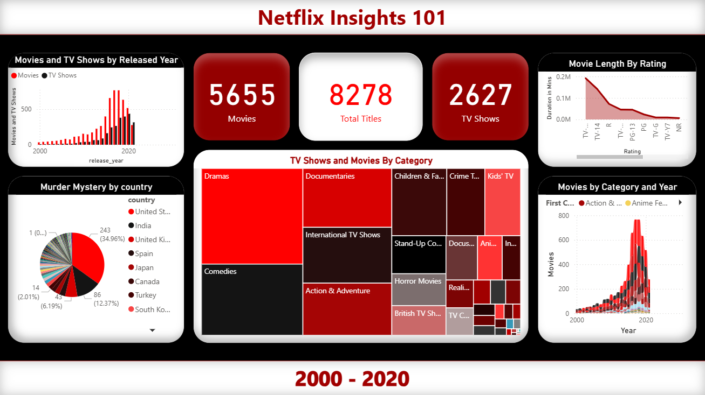

# Netflix Power BI Dashboard 🎬

This project presents a fully interactive Power BI Report that explores Netflix titles from 2000 to 2025. Through detailed EDA (Exploratory Data Analysis) and a clean, dashboard-style layout, the report highlights trends, patterns, and insights across genres, ratings, and countries.

## 💡 Key Features
- Cleaned and transformed raw data using Power Query
- Cards: Total Titles, Movies, TV Shows, Murder Mystery Titles
- Genre Treemap, Release Year Trends, Director Insights
- Dynamic tooltips with % of total
- Custom visual styling inspired by Netflix branding

## 📸 Dashboard Preview

  

## 🛠 Tools Used
- Power BI Desktop
- Power Query (M Language)
- DAX for KPIs and Measures

## 📝 License

This project is licensed under the MIT License
